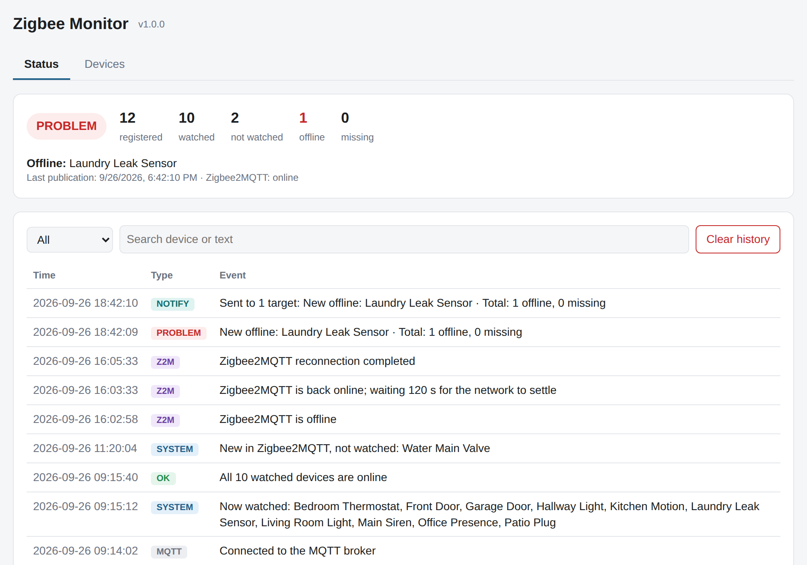
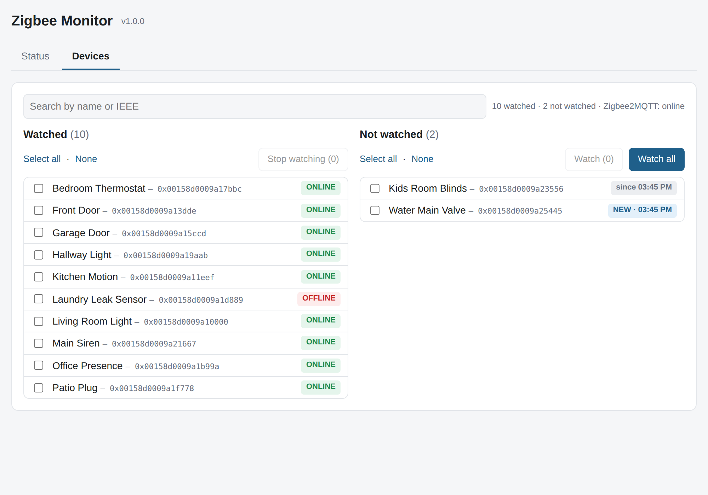

# Zigbee Monitor for Home Assistant

A Home Assistant add-on that watches your **Zigbee2MQTT** devices and alerts you when one goes
**offline** or **disappears** from your network.

## Features

- **Sidebar panel**: choose the devices to watch, see their status and browse the history of changes.
- **Incident reports**: every general failure or Zigbee2MQTT outage is recorded with what happened
  before, during and after, to find out why the network fails.
- **Traffic statistics**: which devices send the most messages.
- **Smart notifications**: one message per change, no repeats, and no false alarms while
  Zigbee2MQTT restarts. Choose which kinds you get (devices, general failure, system), live.
- **Home Assistant entities**: a status sensor, a problem binary sensor, offline/missing counters and
  notification switches, ready for automations and dashboards.
- **Easy setup**: connects automatically to the Mosquitto broker add-on.
- **English and Spanish.**

## Installation

Or add the repository manually: **Settings → Add-ons → Add-on Store → ⋮ → Repositories**, and paste
`https://github.com/rbellizzi71/ha-zigbee-monitor`. Then install **Zigbee Monitor**.

## Requirements

- Home Assistant OS or Supervised.
- Zigbee2MQTT with **availability** enabled.
- An MQTT broker (the Mosquitto add-on is detected automatically).

## Documentation

See [the full documentation](zigbee_monitor/DOCS.md).

## License

[MIT](LICENSE) © Roberto Bellizzi
